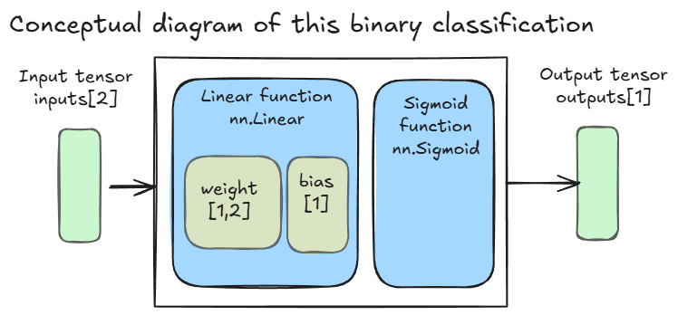
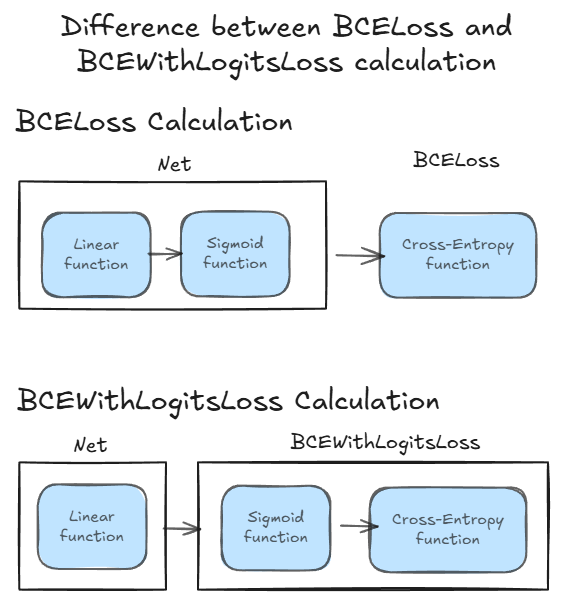

# Binary Classification Task  

## Data Set  
- The data set in this task is "Iris Data Set".  
- URL: [https://archive.ics.uci.edu/dataset/53/iris](https://archive.ics.uci.edu/dataset/53/iris) (When we use this data, we will import the data from sklearn.datasets).  

## Task items 
- Create a simple binary classification model to predict iris  using the sepal_length and sepal_width variables.  

## Conceptual Diagram  
  
- The dimension of the input tensor is 2.  
- Use "nn.Linear" function  

## Important Topics  
- The classification model introduces accuracy as an indicator.  
- Regarding accuracy, implement the “split of training data and validation data.”  
- We use the BCEWithLogitsLoss function instead of the BCELoss function because the calculation of exponential and logarithmic functions independently tends to produce unstable results.  
   

## Code  
[Iris Binary Classification](./IrisDataset.ipynb)  
- This code follows the PyTorch implementation  
  
    1. Prepare the learning dataset (Splitting training and validation dataset)
    1. Create the inputs and the labels
    1. Create the prediction function
    1. Create the loss function
    1. Create the optimization function
    1. Calculate the prediction
    1. Calculate the loss
    1. Calculate the gradient
    1. Adjust parameters  