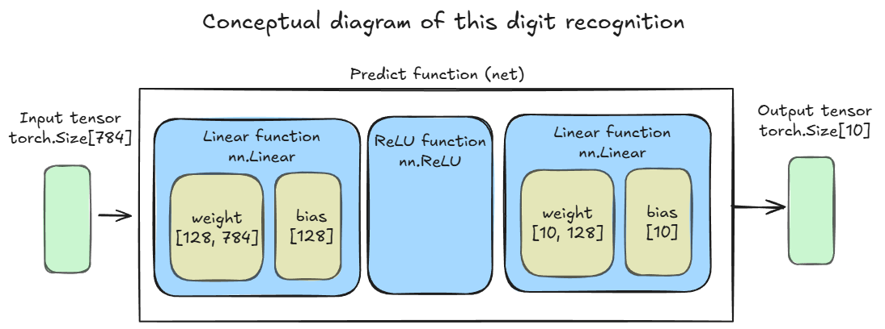

# Digit recognition using MNIST Task  

## Data Set  
- The data set in this task is "MNIST".  
- we will import the data from torchvision.datasets.  

## Task items 
- Create a simple digit recognition model to predict digit.  

## Conceptual Diagram  
  
- The dimension of the input tensor is 784.  
- The dimension of the output tensor is 10.  
- Use "nn.Linear" and "nn.ReLU" function.  

## Important Topics  
- The predict function has a hidden layer.  
- Use "nn.ReLU" function as an activation function.  
- Do data preprocessing for the dataset.  
- Use mini-batch learning when performing gradient calculations.  

## Code  
[MNIST Digit Recognition](MNIST_Dataset.ipynb)  
- This code follows the PyTorch implementation  
  
    1. Prepare the learning dataset (Loading by dataset, data preprocessing using Transforms, and data generation for mini-batches using the data loader)
    1. Create the inputs and the labels
    1. Create the prediction function
    1. Create the loss function
    1. Create the optimization function
    1. Calculate the prediction
    1. Calculate the loss
    1. Calculate the gradient
    1. Adjust parameters  