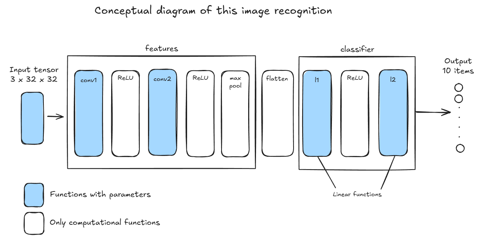
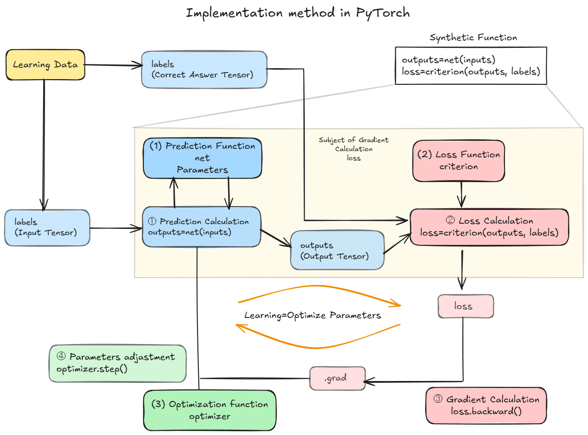

# Image recognition with CNN Task  

## Data Set  
- The data set in this task is "torchvision.datasets".  
- we will import the data from torchvision.datasets.  

## Task items 
- Create a image recognition model with CNN.  

## Conceptual Diagram  
  
- The dimension of the input tensor is 3 x 32 x 32.  
- The dimension of the output is 10.  
- Implement CNN with "features" and "classifier".  
- The flatten function converts the outputs of the convolution and pooling functions into 1-dimensional tensors.  

## Important Topics  
- Implement convolution with nn.Conv2d function.  
- Implement pooling with nn.MaxPool2d function.  

## Code  
[CNN Image Recognition](./CNN.ipynb)  
- This code follows the PyTorch implementation  

  
    1. Prepare the learning dataset
    1. Create the inputs and the labels
    1. Create the prediction function
    1. Create the loss function
    1. Create the optimization function
    1. Calculate the prediction
    1. Calculate the loss
    1. Calculate the gradient
    1. Adjust parameters  