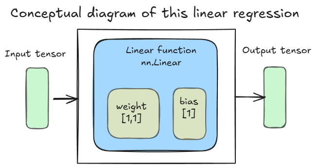

# Linear Regression Task  

## Data Set  
- The data set in this task is "The Boston Housing Dataset".  
- URL: [https://lib.stat.cmu.edu/datasets/boston](https://lib.stat.cmu.edu/datasets/boston)  

## Task items 
- Create a simple regression model to predict real estate prices using the RM variable, which represents the average number of rooms.  
- Create a two-input(RM + LSTAT), one-output model by adding the LSTAT variable representing the low-income rate.  

## Concept Diagram  
  
- Use "nn.Linear" function for prediction  

## Code  
[Boston Housing Linear Regression](./BostonDataset.ipynb)  
- This code follows the PyTorch implementation  
  
    1. Prepare the learning dataset
    1. Create the inputs and the labels
    1. Create the prediction function
    1. Create the loss function
    1. Create the optimization function
    1. Calculate the prediction
    1. Calculate the loss
    1. Calculate the gradient
    1. Adjust parameters  

## Loss calculation graph  
  
- "l1.weight" and "l1.bias" indicate variables of gradient calculation  
- The output of the prediction function is the input to the loss function  