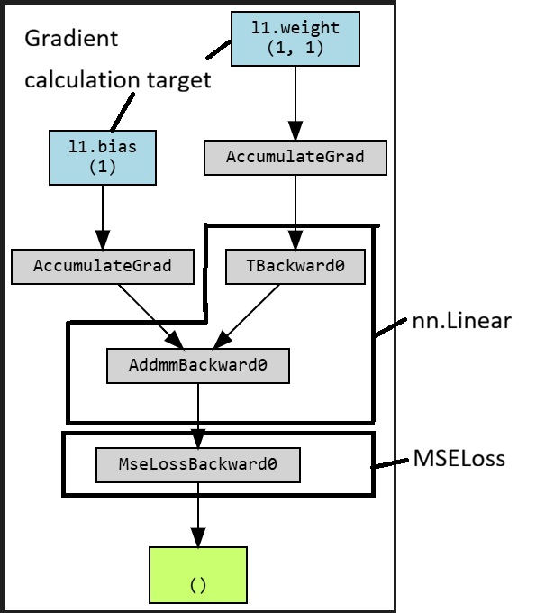

# Linear Regression Task  

## Data Set  
- The data set in this task is "The Boston Housing Dataset".  
- URL: ["https://lib.stat.cmu.edu/datasets/boston"]("https://lib.stat.cmu.edu/datasets/boston")  

## Task items 
- Create a simple regression model to predict real estate prices using the RM variable, which represents the average number of rooms.  
- Create a two-input, one-output model by adding the LSTAT variable representing the low-income rate.  

## Loss calculation graph  
  
- "l1.weight" and "l1.bias" indicate variables of gradient calculation  
- The output of the prediction function is the input to the loss function  

## Code  
[Boston Housing Linear Regression](./BostonDataset.ipynb)  