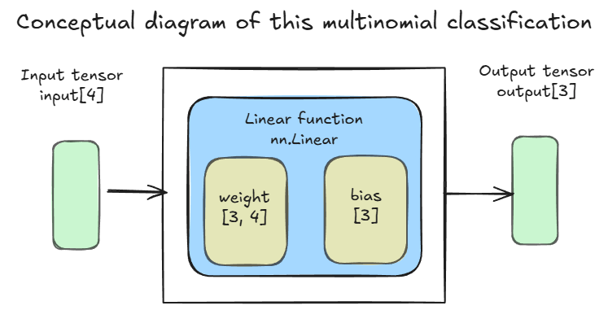
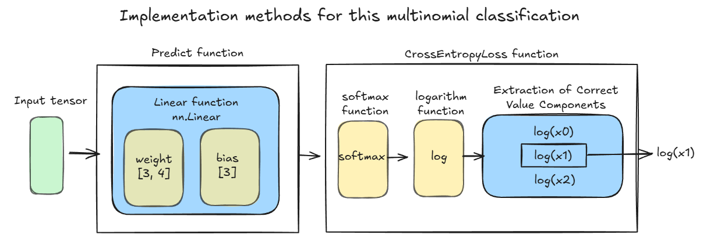

# Multinomial Classification Task  

## Data Set  
- The data set in this task is "Iris Data Set".  
- URL: [https://archive.ics.uci.edu/dataset/53/iris](https://archive.ics.uci.edu/dataset/53/iris) (When we use this data, we will import the data from sklearn.datasets).  

## Task items 
- Create a simple multinomial classification model to predict iris using all the data.  

## Conceptual Diagram  
  
- The dimension of the input tensor is 4.  
- The dimension of the output tensor is 3.  
- Use "nn.Linear" function.  

## Important Topics  
- We use the CrossEntropyLoss function which uses the output of the linear function.  
- To obtain probability values from the prediction function output, multiply the softmax function by the prediction function output.  
- Since the CrossEntropyLoss function uses the nn.NLLLoss function as its final step, the second argument must be integer values.  
  

## Code  
[Iris Multinomial Classification](./IrisDataset_Multinomial.ipynb)  
- This code follows the PyTorch implementation  
  
    1. Prepare the learning dataset (Splitting training and validation dataset)
    1. Create the inputs and the labels
    1. Create the prediction function
    1. Create the loss function
    1. Create the optimization function
    1. Calculate the prediction
    1. Calculate the loss
    1. Calculate the gradient
    1. Adjust parameters  