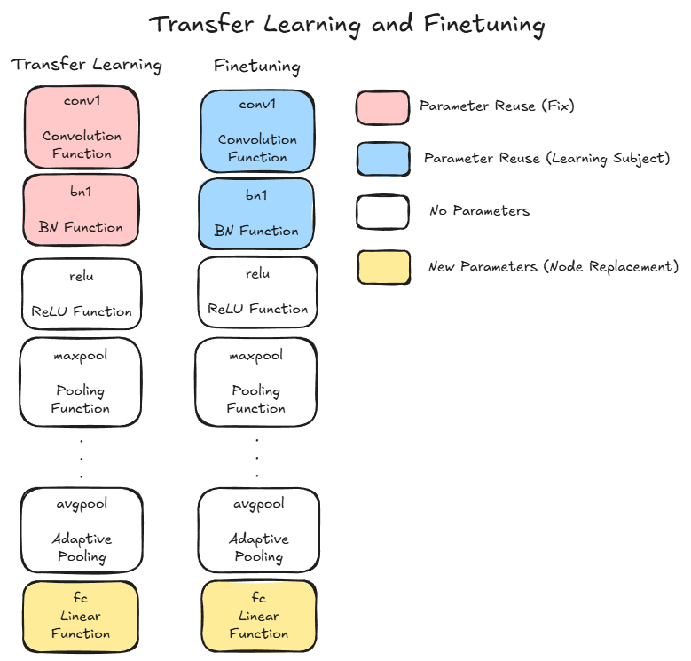

# Pre-Trained Model Task  

## Data Set  
- The data set in this task is the same for the "Image Recognition with CNN Task".  

## Task items 
- Implement the image recognition model with pre-trained model. 
    1. Use ResNet-18 model with finetuning 
    1. Use VGG-19-BN model with finetuning  

## Conceptual Diagram between Transfer Learning and Finetuning  
  
- Transfer Learning: It is a method where, among the parameters of a pre-trained model, all layer functions closer to the input are fixed, and only the parts closer to the output are trained.  
- Finetuning: It utilizes the parameters of a pre-trained model as initial values and trains all layer functions.  
- Generally, fine-tuning is suitable when there is a large amount of training data, while transfer learning is suitable when there is little training data.  

## Important Topics 
- Both ResNet-18 and VGG-19-BN use the adaptive average pooling (nn.AdaptiveAvgPool2d) function, whose purpose is to create a model that can accept input images regardless of their pixel count.  

## Code  
[CNN Image Recognition Updated](./CNN_Tuning.ipynb)  
- This code follows the PyTorch implementation  

  
   1. Prepare the learning dataset
   1. Create the inputs and the labels
   1. Create the prediction function
   1. Create the loss function
   1. Create the optimization function
   1. Calculate the prediction
   1. Calculate the loss
   1. Calculate the gradient
   1. Adjust parameters  