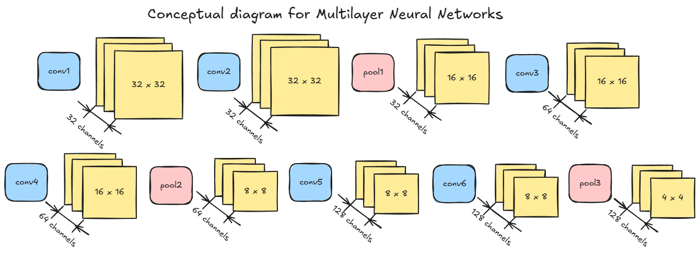
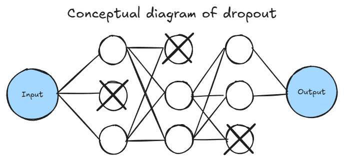
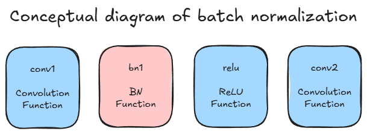

# Tuning Techniques Task  

## Data Set  
- The data set in this task is the same for the "Image Recognition with CNN Task".  

## Task items 
- Implement tuning for the image recognition model with CNN. 
    1. Implementing multi-layer neural networks  
    1. Improve the optimization function  
    1. Implement measures against overfitting  

## Important Topics 
### Implementing multi-layer neural networks  
1. Multilayering  
  
    - To improve accuracy, implement a 6-layer convolution and a 3-layer pooling function.  
    - Each time pooling halves the dimension of the intermediate tensor, doubling the number of channels.  

### Improve the optimization function  
1. momentum
    - Utilize momentum, which remembers past gradient values and uses them to update parameters while reducing those parameters by a fixed ratio.

1. Adam  
    - Utilizing Adam, one of the optimization algorithms  

### Implement measures against overfitting  
1. Dropout
  
    - Swap the input elements participating in each learning session to evenly distribute weight information throughout.  

1. Batch Normalization  
  
    - Use nn.BatchNorm2d during convolution processing and nn.BatchNorm1d immediately after the linear function.  
    - The parameter of nn.BatchNorm2d is the number of channels in the input data.  
    - The parameter of nn.BatchNorm1d is the number of dimensions in the input data.  

1. Data Augmentation  
    - A technique for increasing the variation of training data by processing input data prior to training.  
    - Use "RandomHorizontalFlip" (Randomly flip left and right) and "RandomErasing" (Randomly delete rectangular areas).  

## Code  
[CNN Image Recognition Updated](./CNN.ipynb)  
- This code follows the PyTorch implementation  

  
   1. Prepare the learning dataset
   1. Create the inputs and the labels
   1. Create the prediction function
   1. Create the loss function
   1. Create the optimization function
   1. Calculate the prediction
   1. Calculate the loss
   1. Calculate the gradient
   1. Adjust parameters  